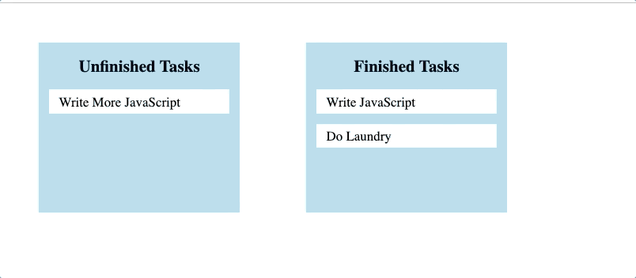

# Drag and Drop Task Tracker

This application was built as a supplement to my blog post about JavaScript drag and drop functionality. You can find the blog [here](https://medium.com/@mrwerner392/javascript-drag-and-drop-with-backend-interactivity-90f5ed68e576?source=friends_link&sk=28d9651bf54e87432f397fa18361dc32). The purpose of the blog (and this application) is to demonstrate a drag and drop feature in JavaScript that interacts with a backend API.

## Installation

To test this app yourself, fork the repository and clone it to your local machine. Then, navigate to the "backend" folder and run:

```
bundle install
rails db:migrate
rails db:seed
```

Use `rails c` to open a console and run `Task.all` to check that your migration and seeding worked. You should have three task objects.

Lastly, navigate to the "frontend" folder and open the index.html file:

```
open index.html
```

## Usage

Once you have the application open in your browser, you can drag/drop the tasks back and forth between the task containers. On a page refresh, you should see that the tasks stay wherever you dropped them (though not necessarily in the same order).



## Technologies

1. JavaScript
2. CSS
3. HTML
4. Rails API
